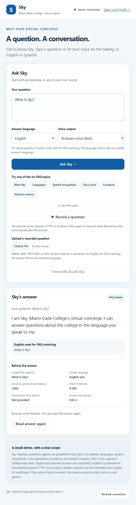

# CAI3303C TTS Demo — Giving Sky a Voice

A classroom prototype combining Whisper speech recognition, FAQ matching, and F5-TTS speech generation. The browser demo accepts typed questions, uploaded recordings, and microphone recordings.

## Run on the prepared Windows computer

Open PowerShell in this folder:

```powershell
.\Start-TTS.ps1
```

Leave the terminal open and visit **http://localhost:5000**. This one server provides both the browser demo and the speech API.

- Ask **What is Sky?** to demonstrate a known answer.
- Ask **How much is tuition?** to demonstrate the fallback rather than a guessed answer.
- Upload a short recording to demonstrate Whisper transcription.
- Select **Browser voice (fast)** for immediate speech, or **F5-TTS (model)** to generate a real model-produced WAV. Browser voice uses your device's speech engine; it does not use F5-TTS.

F5-TTS took about 95 seconds to generate a 4.7-second clip on the development laptop's CPU. Longer answers can take several minutes. Browser microphone recording requires microphone permission and localhost or HTTPS. Recorded uploads work without a live microphone.

The original Java assignment test is still available in a second terminal:

```powershell
.\Test-TTS.ps1
```

Its output is `gen_audio/output.wav`. The CLI Sky demo also remains available through `Start-Demo.ps1`; see [demo/README.md](demo/README.md).

## Set up another computer

Install Python 3.12, Git, ffmpeg, and (for the Java exercise) a Java JDK. Clone with the pinned F5-TTS source:

```text
git clone --recurse-submodules https://github.com/MCDR-Code/CAI3303C_TTS_Demo.git
cd CAI3303C_TTS_Demo
```

On Windows, run `./Setup-TTS.ps1`, then `./Start-TTS.ps1`.

On Linux:

```sh
python3 scripts/setup_project.py --cpu
.venv/bin/python imv_api.py
```

Setup installs the demo dependencies, applies the preserved Windows WAV-loading fix to the pinned F5-TTS revision, and downloads the Whisper base model. The F5-TTS model downloads on first speech generation. Internet access, sufficient disk space, and several minutes of setup time are needed.

If PowerShell blocks a script, run `powershell -ExecutionPolicy Bypass -File ./Start-TTS.ps1` (or the corresponding setup/test script). This affects that process only.

## Run in GitHub's cloud

**GitHub Codespaces can run this application. GitHub Pages cannot run its Python backend.** A Codespaces configuration is included in `.devcontainer/`.

1. On this repository, select **Code → Codespaces → Create codespace on main**.
2. Allow the container's setup to finish; it installs ffmpeg, Java, dependencies, the pinned source, and Whisper.
3. In the Codespaces terminal, run `.venv/bin/python imv_api.py`.
4. Open forwarded **port 5000** from the Ports panel. The browser demo uses the same forwarded HTTPS address for the page and all API calls.
5. Stop the codespace after your demonstration. The public repository remains available; a running codespace has separate usage and billing rules.

The forwarded port is private by default. Your instructor can create their own codespace from this public repository. To share *your running demo*, you can change port 5000 visibility to public while it is running; anyone with that URL can then use its unauthenticated demo API. Keep recordings you upload suitable for the audience.

This is a CPU demo configuration; live F5-TTS may be slow. A GPU host such as Hugging Face Spaces is a possible later deployment option. No Codespaces instance or paid host has been started by preparing this repository. Cloud container execution has not yet been verified; local tests are reported in [RUN_RESULTS.md](RUN_RESULTS.md).

References: [GitHub Codespaces](https://docs.github.com/en/codespaces/about-codespaces/deep-dive), [port forwarding](https://docs.github.com/en/codespaces/developing-in-a-codespace/forwarding-ports-in-your-codespace), [GitHub Pages limitations](https://docs.github.com/en/pages/getting-started-with-github-pages/creating-a-github-pages-site).

## Preview



## Project layout

| Location | Purpose |
| --- | --- |
| `imv_api.py` | Browser demo, voice studio, and F5-TTS API server |
| `demo/` | Browser interface, FAQ, Whisper integration, and CLI demo |
| `frontend/` | Optional voice-registration and direct TTS interface at `/studio` |
| `F5-TTS/` | Pinned upstream Git submodule |
| `patches/` | WAV-loading compatibility fix reapplied by setup |
| `scripts/setup_project.py` | Shared Windows/Linux/Codespaces setup |
| `.devcontainer/` | GitHub Codespaces environment |
| `tests/`, `.github/workflows/` | API checks and GitHub Actions |
| `docs/` | Explanation, presentation guide, and dependency attribution |
| `PROMPT_LOG.md` | Assignment prompt history and learning synopsis |
| `older/` | Local historical files, excluded from GitHub |
| `.venv/`, `.build/`, `data/`, `gen_audio/` | Local environment, build output, and runtime files; excluded from GitHub |

The `F5-TTS` submodule shows a local modification after setup because the compatibility patch is applied. Keep the patch in `patches/`; do not commit the change to the upstream project.

## Scope and verification

The FAQ has six topics. Matching uses TF-IDF with a 0.5 threshold. Spoken non-English input is translated into English for matching; Spanish input can receive a Spanish answer. Typed questions should be in English; the answer-language selector can choose Spanish. Unmatched questions return a fallback, but the prototype does not connect to a human.

Model checkpoints and personal reference recordings are not stored in this repository. See [docs/THIRD_PARTY.md](docs/THIRD_PARTY.md) for upstream code/model licensing and [docs/DEMO_GUIDE.md](docs/DEMO_GUIDE.md) for a classroom walkthrough.
